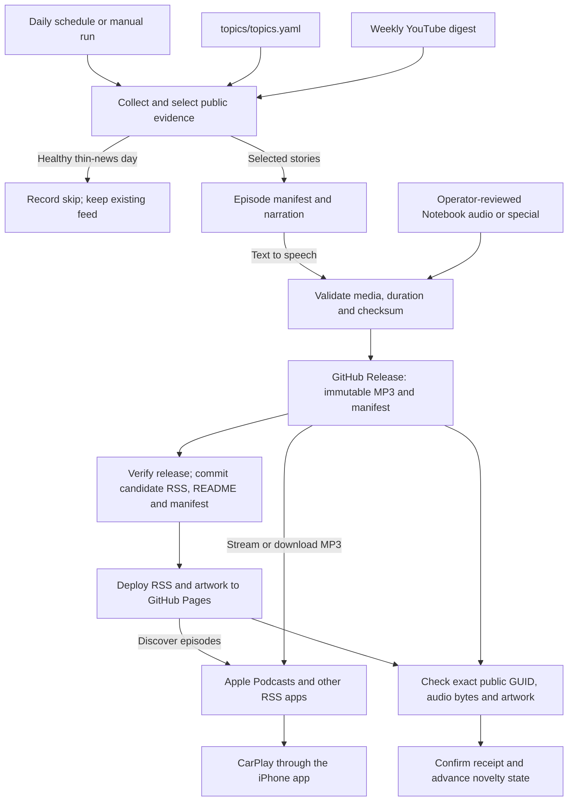

# Daily AI Developer Brief — Special: Parallel coding agents in VS Code: useful delegation, shared-state risks, and verification

<p align="center">
  
</p>
<p align="center"><em>Keep up with AI developer technology without being flattened by the update wave.</em></p>

A concise, source-backed daily podcast for AI agent developers: what changed, why it matters, what is worth learning, and whether to act, watch, or skip.

## Podcast

Intended subscriber feed: `https://johnsirmon.github.io/daily-ai-docs/podcast.xml`

Publication is confirmed only after the subscriber feed, audio, and artwork pass delivery checks.

Once the feed is live, open Apple Podcasts on iPhone → Library → Follow a Show by URL and paste it. CarPlay uses the followed show through Apple Podcasts; device playback still requires verification.

See [operations and setup](docs/OPERATIONS.md#github-setup) for deployment status and setup.

## How it works

1. Public primary sources are collected with per-source health reporting.
2. Ranking and editorial checks reject repeats, routine noise, and unsupported claims.
3. The episode manifest binds every selected story to its evidence and becomes the source of truth.
4. Narration or reviewed browser audio is validated before an immutable release is created.
5. Publication is confirmed only after the feed serves the exact expected episode and media bytes.

A healthy thin-news day can intentionally skip publication. Failures before candidate publication leave the existing subscriber feed untouched. A delivery failure after deployment can leave an unconfirmed candidate visible; it must be recovered without replacing its audio or advancing novelty state.



Approved manual imports join the same serialized publisher; issue intake and unpublished previews do not publish episodes. The diagram shows the successful publication path and intentional skip; validation failures stop the run. HTTP delivery checks do not certify iPhone or CarPlay playback.

## When and where it publishes

| Process | Trigger / target time | Result |
| --- | --- | --- |
| [Daily publisher](.github/workflows/update-radar.yml) | Daily **10:17 UTC** (06:17 EDT / 05:17 EST), or manual | Evaluates new evidence; publishes only when gates pass. |
| [Reviewed imports and specials](docs/OPERATIONS.md#publishing-approved-notebook-audio) | Manual, after review and authorization | Uses the daily publisher with a `reviewed_episode` release tag. |
| [Pages recovery](.github/workflows/pages.yml) | Relevant pushes to `main`, or manual | Redeploys the existing feed and artwork; does not generate audio. |
| [Feed health](.github/workflows/feed-health.yml) | Daily **12:47 UTC** (08:47 EDT / 07:47 EST), or manual | Checks delivery and a 25-hour freshness budget; accepts verified intentional skips and reports failures in an issue. |
| [YouTube discovery](.github/workflows/youtube-trends.yml) | Sunday **11:23 UTC** (07:23 EDT / 06:23 EST), or manual | Updates an input digest, not a standalone podcast episode. |

These are GitHub Actions schedule targets, not guaranteed release times. Publication requires preparation, release upload, Pages deployment, and subscriber-facing verification. Apple Podcasts refreshes and downloads independently; there is no scheduled push directly to Apple or CarPlay.

- **Discovery:** [RSS feed](https://johnsirmon.github.io/daily-ai-docs/podcast.xml) and show artwork on GitHub Pages. The Pages site does not host episode MP3s or the rendered README.
- **Audio:** [GitHub Releases](https://github.com/johnsirmon/daily-ai-docs/releases), using a permanent, unique enclosure URL for each episode. Released bytes and GUIDs are never replaced.
- **Written brief:** this README on the repository's `main` branch, generated from the episode manifest.
- **Audit trail:** [`data/episodes`](data/episodes), [`data/receipts`](data/receipts), [`data/runs/latest.json`](data/runs/latest.json), and [`data/state.json`](data/state.json). The manifest/RSS timestamp is assigned before delivery; `confirmed_at` records successful verification.

Daily publishing, standalone Pages deployment, and weekly digest writes share the non-cancelling `podcast-publisher` lock. The daily job deploys Pages inline rather than waiting on another locked job. See [publishing review and optimization priorities](docs/OPERATIONS.md#publishing-review-and-optimization-priorities).

## Try the Notebook browser pilot

1. Sign in to Gemini Notebook and create a dedicated notebook for the pilot.
2. Add only the selected public primary-source URLs; include full methods and limitations for research.
3. Configure an English Deep Dive targeting 5–8 minutes with concrete changes, implications, and caveats.
4. Generate once, download once, and complete the native Save dialog manually if the browser cannot.
5. Preserve the original file, fully decode it, measure its duration, and record its size and SHA-256.
6. Review the transcript and consequential spoken claims against the imported primary sources.

The pilot uses the signed-in account's existing allowance. It does not authorize a paid upgrade, cookie export, unattended browser automation, or publication. Approved recordings use the separate [reviewed-audio handoff](docs/OPERATIONS.md#publishing-approved-notebook-audio).

### Editorial correction

Production note: This episode uses AI-generated narration. Before the conversation, an editorial correction. At about 16 minutes, the discussion compares 50 caller locations with 12 test patterns. Those counts alone do not establish 38 untested paths, and missing tests do not guarantee a regression. Map callers to tests and investigate the actual coverage. The July subagent update improves visibility. It does not prove developers previously had no way to inspect running work. An activity indicator does not establish exact approval or execution timing and cannot guarantee that side effects are prevented. Terminal sandboxing applies to terminal commands and child processes, not built-in file tools. The conversations claim that all such tools run inside the trusted editor process is not established by the sources. Treat the API migration as a hypothetical teaching example. Its blanket statements about shared workspaces and port conflicts are practical cautions, not universal guarantees. Model agreement is not proof of correctness, the sources do not establish identical training data for every model. These corrections qualify the discussion that follows. The original conversation is otherwise unchanged.

## Today's signal

Long-form special for AI developers.
Evidence window: 60 days ending 2026-09-19T16:36:05.411476+00:00.
Audio provider: gemini-notebook-web; transcript/source reviewed, not Gemini API verification.

### Plan the boundaries before multiplying agents

**What changed:** The July 29 release adds model, elapsed-time, and active-tool visibility for running subagents in the Agents window, with access to their conversation while retaining the parent chat. This improves oversight of an existing delegation capability; it does not introduce planning or subagents for the first time.

**Why it matters:** Separate research contexts are useful when independent investigations would overwhelm the main conversation. Planning should identify a deliverable, dependencies, editable scope, and verification for each branch. Current undated documentation describes the Plan agent's read-only research and review-before-implementation flow.

**Recommendation:** ACT — Editorial recommendation: for a cross-cutting API change, first agree on the interface and acceptance tests; delegate independent codebase research, not conflicting edits. Keep small, well-understood fixes in one conversation.

Sources: [1](https://code.visualstudio.com/updates/v1_131), [2](https://code.visualstudio.com/docs/agents/concepts/agents), [3](https://code.visualstudio.com/docs/agents/run/planning)

### Separate conversation history is not separate files

**What changed:** The July 22 release extends the Agents window's worktree option from the already-supported Copilot harness to Claude and Codex harnesses on the Agent Host. The same release adds assisted permissions, where a model decides whether a tool call needs human approval.

**Why it matters:** Current undated session documentation explicitly says chats inside one session share workspace and code isolation despite independent conversation histories. Worktree isolation concerns the working copy; it is not a claim of operating-system or external-service isolation. Model-assisted approval is not an assertion that an action is safe.

**Recommendation:** ACT — Editorial recommendation: use shared-session chats for coordinated work with explicit file ownership; prefer separate worktrees for competing implementations. Assign distinct test resources where necessary and inspect the combined diff before integrating.

Sources: [1](https://code.visualstudio.com/updates/v1_130), [2](https://code.visualstudio.com/docs/agents/concepts/sessions), [3](https://github.blog/changelog/2026-07-30-github-copilot-in-visual-studio-code-july-2026-releases/)

### Ask a side question without pretending it is an isolated worker

**What changed:** The August 5 release adds /btw side chats that share the primary chat's context and prompt cache without interrupting the active turn, alongside live activity entry points for diffs and subagents.

**Why it matters:** A contextual question, an independent research subagent, and a parallel implementation session serve different needs. The current subagent documentation describes stateless invocations requiring a complete task prompt; current session documentation separately describes cross-session follow-up messaging. Do not generalize one API's lifecycle to every Copilot surface.

**Recommendation:** ACT — Editorial recommendation: use a side chat to understand an ongoing decision, a bounded subagent for independent research, and a separate isolated session for a competing implementation. Inspect the worker's evidence rather than accepting an impressive summary.

Sources: [1](https://code.visualstudio.com/updates/v1_132/), [2](https://code.visualstudio.com/docs/agents/run/subagents)

### Follow the same work across windows, but know what keeps it alive

**What changed:** The August 26 architecture article explains moving agent session ownership out of a window-bound extension host into a dedicated Agent Host and open Agent Host Protocol. It documents availability in Stable and Insiders; earlier July and August release notes already described progressive rollout.

**Why it matters:** Parallel background sessions existed in late 2025. The newer boundary is continued session execution across folder or editor-window changes and synchronized clients, not the invention of parallelism. Local VS Code-managed sessions still need VS Code running. A common protocol does not make different harnesses behave identically.

**Recommendation:** WATCH — Editorial recommendation: identify the host, workspace, harness, and owning session before supervising remote or long-running work. Seeing the same session in two windows is not evidence of two independent workers.

Sources: [1](https://code.visualstudio.com/blogs/2026/08/26/agent-host-architecture)

### The useful finish line is a verified integrated change

**What changed:** The September 16 release describes one Agents window form for inspecting generated pull-request titles and descriptions, choosing draft status, and configuring available merge options. Agent Merge is a separate experimental opt-in, not a default promise of safe unattended merging.

**Why it matters:** Parallel work increases the importance of reviewing the combined changes and executing validation against the final integration. Official trust guidance says generated code needs review, external side effects are not undone by restoring workspace files, and terminal sandboxing does not cover built-in file tools.

**Recommendation:** ACT — Editorial recommendation: ask every worker for changed files, exact test commands and outcomes, unverified assumptions, and remaining risks. Then run integration checks, inspect the PR diff and CI evidence, and retain human approval for consequential changes.

Sources: [1](https://code.visualstudio.com/updates/v1_138), [2](https://code.visualstudio.com/docs/agents/concepts/trust-and-safety), [3](https://code.visualstudio.com/docs/agents/run/agent-sandboxing)

## High noise / low signal

- REQUEST BINDING: Read request.json for adhoc-fdb65c39609a3f98125084ed. Its actual frozen evidence interval is 2026-07-21T16:36:05.411476+00:00 through 2026-09-19T16:36:05.411476+00:00 (60 days). The earlier 16:35 cutoff stated in show_notes is the original research instruction, not the request cutoff; no selected event is near either boundary, and every selected original publication date satisfies both windows. The generated Notebook brief uses the actual request interval. This packet and all research produced by this worker now reside in the request directory.
- No evidence-backed universal speedup, optimal agent count, credit multiplier, or quality improvement is established by these sources. Do not manufacture metrics to fill the duration.
- Undated documentation is explanatory corroboration, not a recency-eligible launch. Preserve the section labels in each evidence field when conducting later exact claim review.
- The July 30 GitHub recap spans earlier July releases, including dates outside the window. Only July 22 and July 29 changes directly verified against their release pages are used; the recap alone is not evidence that all July features shipped after July 21.
- The Agent Host was already in progressive rollout in July and early August release notes. August 26 is the dated architecture explanation and availability statement, not a verified first-launch date.
- July Agents window features were labeled Preview; September 16 Agent Merge is experimental and requires chat.agentMerge.enabled. A stable VS Code release does not make every included capability generally available.
- VS Code 1.138 notes explicitly disclose AI generation and possible inaccuracies. Retain this caveat for consequential claims; no enabled-feature or account-entitlement verification was performed.
- Generic subagent docs and Agent Host multi-chat/session docs describe different lifecycles. Avoid universal claims about statelessness, follow-up messages, recursive delegation, or model routing across all harnesses.
- Only bounded excerpts are retained. No full copyrighted source text, fabricated hashes, generated transcript provenance, audio review, request authorization, or publication outcome is present.
- GitHub CLI was unauthenticated. Current episode inventory was checked successfully through the public REST endpoint instead; all ten filenames matched the local published-manifest inventory. Remote manifest contents were not independently compared byte-for-byte.
- Two guessed documentation URLs returned 404; the canonical planning and concepts/session pages were subsequently obtained and fully read. No failed URL is used as supporting evidence.
- The brief command renders event titles/URLs and request constraints but does not embed this substantive outline or complete claim worksheet. The parent should explicitly include this packet's show_notes and bounded evidence in the Notebook production source/instructions rather than relying on notebook-brief.md alone.

## Editorial contract

- An Edge-TTS editorial correction precedes the retained Notebook conversation; the manifest records both component hashes and the exact correction text.

- Scheduled daily at **10:17 UTC**; GitHub Actions timing is best-effort.
- Up to seven actionable stories, capped per product for variety; thin-news runs skip publication.
- Opt-in grounded editorial mode groups meaningful changes into 5–8-minute briefs without changing the feed on thin-news days.
- Grounded mode can include one reviewed recent-paper takeaway, with its method, limitations, and practical experiment; it does not repeat papers as filler.
- Product-change claims require public primary evidence.
- This edition preserves a conversational format; `ACT`, `WATCH`, or `SKIP` recommendations appear in the written story notes, not as required spoken endings.
- Routine patches, repeated announcements, unsupported adoption claims, and engagement-only rankings are filtered out.
- At most one transcript-backed YouTube learning pick may appear; it never replaces vendor evidence.

## Tracked areas

The active `daily.sources` configuration in [`topics/topics.yaml`](topics/topics.yaml) monitors public releases and feeds for GitHub Copilot, VS Code, OpenAI Codex, Claude Code, Gemini CLI, Hermes Agent, MCP, and Agent Skills. Evaluation and observability are covered through bounded YouTube learning discovery rather than dedicated primary-source collectors.

## Source health

- `manual:code.visualstudio.com:dated-primary-events`: ok:5
- `manual:code.visualstudio.com:undated-background-docs`: ok:5
- `manual:github.blog:dated-corroboration`: ok:1
- `manual:published-episode-inventory`: ok:10

Each edition manifest distinguishes healthy no-news results from source outages.

## Publication flow

`collect → select → manifest → narrate/audio → validate → publish → verify delivery → confirm`

The versioned episode manifest is the source of truth for narration, show notes, and this README. Preparation and failed delivery do not advance novelty state.
All intentional skips have durable run receipts. Monitoring still verifies the last confirmed feed, audio, and artwork and rejects failed or stale evaluations.

## Weekly YouTube signal

The Sunday **11:23 UTC** workflow runs four focused searches and retains up to five videos with short transcript-derived takeaways. Full transcripts are never committed, and at most one deduplicated learning pick may enter a daily edition.

## Development

```bash
# Reproducible test suite
uv run --with-requirements requirements.lock pytest -q

# Network-free manifest preparation; writes only under .cache/
uv run --with-requirements requirements.lock \
  python -m pipeline.daily prepare --dry-run --no-audio
```

Preparation does not publish or modify the subscriber feed. See [operations and setup](docs/OPERATIONS.md) for credentials, deployment, recovery, and manual commands.
