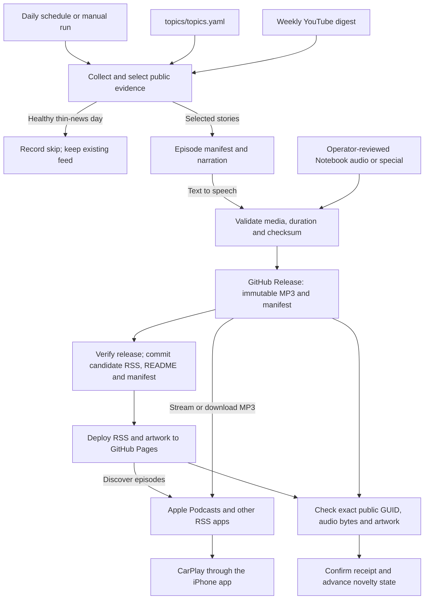

# Daily AI Developer Brief — Special: OpenStock for AI Developers: A Practical Investment Research Workflow

<p align="center">
  
</p>
<p align="center"><em>Keep up with AI developer technology without being flattened by the update wave.</em></p>

A concise, source-backed daily podcast for AI agent developers: what changed, why it matters, what is worth learning, and whether to act, watch, or skip.

## Podcast

Intended subscriber feed: `https://johnsirmon.github.io/daily-ai-docs/podcast.xml`

Publication is confirmed only after the subscriber feed, audio, and artwork pass delivery checks.

Once the feed is live, open Apple Podcasts on iPhone → Library → Follow a Show by URL and paste it. CarPlay uses the followed show through Apple Podcasts; device playback still requires verification.

See [operations and setup](docs/OPERATIONS.md#github-setup) for deployment status and setup.

## How it works

1. Public primary sources are collected with per-source health reporting.
2. Ranking and editorial checks reject repeats, routine noise, and unsupported claims.
3. The episode manifest binds every selected story to its evidence and becomes the source of truth.
4. Narration or reviewed browser audio is validated before an immutable release is created.
5. Publication is confirmed only after the feed serves the exact expected episode and media bytes.

A healthy thin-news day can intentionally skip publication. Failures before candidate publication leave the existing subscriber feed untouched. A delivery failure after deployment can leave an unconfirmed candidate visible; it must be recovered without replacing its audio or advancing novelty state.



Approved manual imports join the same serialized publisher; issue intake and unpublished previews do not publish episodes. The diagram shows the successful publication path and intentional skip; validation failures stop the run. HTTP delivery checks do not certify iPhone or CarPlay playback.

## When and where it publishes

| Process | Trigger / target time | Result |
| --- | --- | --- |
| [Daily publisher](.github/workflows/update-radar.yml) | Daily **10:17 UTC** (06:17 EDT / 05:17 EST), or manual | Evaluates new evidence; publishes only when gates pass. |
| [Reviewed imports and specials](docs/OPERATIONS.md#publishing-approved-notebook-audio) | Manual, after review and authorization | Uses the daily publisher with a `reviewed_episode` release tag. |
| [Pages recovery](.github/workflows/pages.yml) | Relevant pushes to `main`, or manual | Redeploys the existing feed and artwork; does not generate audio. |
| [Feed health](.github/workflows/feed-health.yml) | Daily **12:47 UTC** (08:47 EDT / 07:47 EST), or manual | Checks delivery and a 25-hour freshness budget; accepts verified intentional skips and reports failures in an issue. |
| [YouTube discovery](.github/workflows/youtube-trends.yml) | Sunday **11:23 UTC** (07:23 EDT / 06:23 EST), or manual | Updates an input digest, not a standalone podcast episode. |

These are GitHub Actions schedule targets, not guaranteed release times. Publication requires preparation, release upload, Pages deployment, and subscriber-facing verification. Apple Podcasts refreshes and downloads independently; there is no scheduled push directly to Apple or CarPlay.

- **Discovery:** [RSS feed](https://johnsirmon.github.io/daily-ai-docs/podcast.xml) and show artwork on GitHub Pages. The Pages site does not host episode MP3s or the rendered README.
- **Audio:** [GitHub Releases](https://github.com/johnsirmon/daily-ai-docs/releases), using a permanent, unique enclosure URL for each episode. Released bytes and GUIDs are never replaced.
- **Written brief:** this README on the repository's `main` branch, generated from the episode manifest.
- **Audit trail:** [`data/episodes`](data/episodes), [`data/receipts`](data/receipts), [`data/runs/latest.json`](data/runs/latest.json), and [`data/state.json`](data/state.json). The manifest/RSS timestamp is assigned before delivery; `confirmed_at` records successful verification.

Daily publishing, standalone Pages deployment, and weekly digest writes share the non-cancelling `podcast-publisher` lock. The daily job deploys Pages inline rather than waiting on another locked job. See [publishing review and optimization priorities](docs/OPERATIONS.md#publishing-review-and-optimization-priorities).

## Try the Notebook browser pilot

1. Sign in to Gemini Notebook and create a dedicated notebook for the pilot.
2. Add only the selected public primary-source URLs; include full methods and limitations for research.
3. Configure an English Deep Dive targeting 5–8 minutes with concrete changes, implications, and caveats.
4. Generate once, download once, and complete the native Save dialog manually if the browser cannot.
5. Preserve the original file, fully decode it, measure its duration, and record its size and SHA-256.
6. Review the transcript and consequential spoken claims against the imported primary sources.

The pilot uses the signed-in account's existing allowance. It does not authorize a paid upgrade, cookie export, unattended browser automation, or publication. Approved recordings use the separate [reviewed-audio handoff](docs/OPERATIONS.md#publishing-approved-notebook-audio).

## Today's signal

Long-form special for Stock-owning developers, not expert traders. Exact source-checked single-narrator script; retain the 60-day evidence window. Distinguish documented changes from proposed research workflows and unproven investment returns..
Evidence window: 60 days ending 2026-09-21T13:46:13.649523+00:00.
Audio provider: edge; transcript/source reviewed, not Gemini API verification.

### OpenStock for AI Developers: A Practical Investment Research Workflow

**What changed:** OpenStock corrected its newsletter documentation to describe a weekly Kit broadcast instead of daily personalized watchlist summaries. A separate change updated the MiniMax provider default while preserving the model environment override.

**Why it matters:** These changes help bound an evaluation of documentation and provider configuration. They do not establish an implementation history, predictive accuracy, or investment returns.

**Recommendation:** WATCH — Consider a source-linked research inbox, a thesis journal, and a paper-only evaluation before relying on an AI-assisted investing workflow. These are proposed practices, not verified shipped features or measured benefits.

Sources: [1](https://github.com/Open-Dev-Society/OpenStock/commit/a2e010ec610ad67686df97ad8a5621dccc6c2a4e), [2](https://github.com/Open-Dev-Society/OpenStock/commit/99bab9124e8a994b337ed4d7731cccf693af4390)

## High noise / low signal

- Older implementation findings and the older paper-trading proposal remain outside this episode's evidence.
- No timezone, maintainer motive, model capability comparison, deprecation schedule, or investment performance is inferred.
- The user explicitly authorized an exact-script Edge recording after two unpublished Notebook takes failed review.

## Editorial contract

- Scheduled daily at **10:17 UTC**; GitHub Actions timing is best-effort.
- Up to seven actionable stories, capped per product for variety; thin-news runs skip publication.
- Opt-in grounded editorial mode groups meaningful changes into 5–8-minute briefs without changing the feed on thin-news days.
- Grounded mode can include one reviewed recent-paper takeaway, with its method, limitations, and practical experiment; it does not repeat papers as filler.
- Product-change claims require public primary evidence.
- This edition preserves a conversational format; `ACT`, `WATCH`, or `SKIP` recommendations appear in the written story notes, not as required spoken endings.
- Routine patches, repeated announcements, unsupported adoption claims, and engagement-only rankings are filtered out.
- At most one transcript-backed YouTube learning pick may appear; it never replaces vendor evidence.

## Tracked areas

The active `daily.sources` configuration in [`topics/topics.yaml`](topics/topics.yaml) monitors public releases and feeds for GitHub Copilot, VS Code, OpenAI Codex, Claude Code, Gemini CLI, Hermes Agent, MCP, and Agent Skills. Evaluation and observability are covered through bounded YouTube learning discovery rather than dedicated primary-source collectors.

## Source health

- `github:Open-Dev-Society/OpenStock`: ok:2

Each edition manifest distinguishes healthy no-news results from source outages.

## Publication flow

`collect → select → manifest → narrate/audio → validate → publish → verify delivery → confirm`

The versioned episode manifest is the source of truth for narration, show notes, and this README. Preparation and failed delivery do not advance novelty state.
All intentional skips have durable run receipts. Monitoring still verifies the last confirmed feed, audio, and artwork and rejects failed or stale evaluations.

## Weekly YouTube signal

The Sunday **11:23 UTC** workflow runs four focused searches and retains up to five videos with short transcript-derived takeaways. Full transcripts are never committed, and at most one deduplicated learning pick may enter a daily edition.

## Development

```bash
# Reproducible test suite
uv run --with-requirements requirements.lock pytest -q

# Network-free manifest preparation; writes only under .cache/
uv run --with-requirements requirements.lock \
  python -m pipeline.daily prepare --dry-run --no-audio
```

Preparation does not publish or modify the subscriber feed. See [operations and setup](docs/OPERATIONS.md) for credentials, deployment, recovery, and manual commands.
