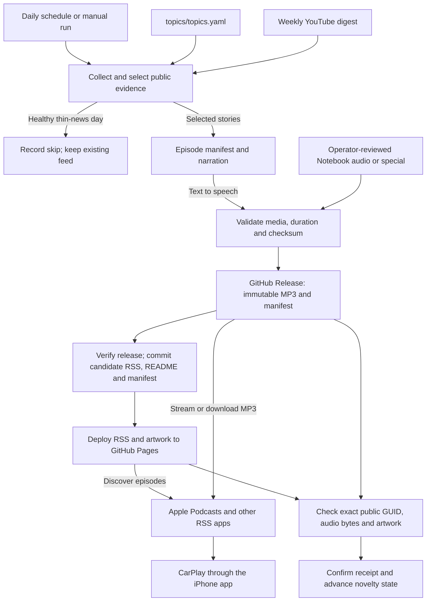

# Daily AI Developer Brief — Special: Desktop pets: useful companions or distracting overhead?

<p align="center">
  
</p>
<p align="center"><em>Keep up with AI developer technology without being flattened by the update wave.</em></p>

A source-backed briefing for AI developers: what changes your work, what is worth trying, and what to ignore.

## Podcast

Intended subscriber feed: `https://johnsirmon.github.io/daily-ai-docs/podcast.xml`

Publication is confirmed only after the subscriber feed, audio, and artwork pass delivery checks.

Once the feed is live, open Apple Podcasts on iPhone → Library → Follow a Show by URL and paste it. CarPlay uses the followed show through Apple Podcasts; device playback still requires verification.

See [operations and setup](docs/OPERATIONS.md#github-setup) for deployment status and setup.

## How it works

1. Public primary sources are collected with per-source health reporting.
2. Ranking and editorial checks reject repeats, routine noise, and unsupported claims.
3. The episode manifest binds every selected story to its evidence and becomes the source of truth.
4. Narration or reviewed browser audio is validated before an immutable release is created.
5. Publication is confirmed only after the feed serves the exact expected episode and media bytes.

On a healthy quiet-news day, the grounded pipeline reviews a relevant, uncovered paper first published within 30 days. Full-text evidence and independent verification remain required. If neither news nor research clears the gates, record a skip and report the daily delivery gap. Failures before candidate publication leave the subscriber feed untouched. A delivery failure can leave an unconfirmed candidate visible; recover it without replacing audio or advancing novelty state.


```mermaid
flowchart TD
    schedule["Daily schedule or manual run"] --> prepare["Collect and select public evidence"]
    config["topics/topics.yaml"] --> prepare
    weekly["Weekly YouTube digest"] --> prepare
    prepare -->|Healthy thin-news day| skip["Record skip; keep existing feed"]
    prepare -->|Selected stories| script["Episode manifest and narration"]
    script -->|Text to speech| validate["Validate media, duration and checksum"]
    reviewed["Operator-reviewed Notebook audio or special"] --> validate
    validate --> release["GitHub Release: immutable MP3 and manifest"]
    release --> candidate["Verify release; commit candidate RSS, README and manifest"]
    candidate --> pages["Deploy RSS and artwork to GitHub Pages"]
    pages -->|Discover episodes| clients["Apple Podcasts and other RSS apps"]
    release -->|Stream or download MP3| clients
    clients --> carplay["CarPlay through the iPhone app"]
    pages --> delivery["Check exact public GUID, audio bytes and artwork"]
    release --> delivery
    delivery --> confirmed["Confirm receipt and advance novelty state"]
```

Approved manual imports join the same serialized publisher; issue intake and unpublished previews do not publish episodes. The diagram shows the successful publication path and intentional skip; validation failures stop the run. HTTP delivery checks do not certify iPhone or CarPlay playback.

## When and where it publishes

| Process | Trigger / target time | Result |
| --- | --- | --- |
| [Daily publisher](.github/workflows/update-radar.yml) | Daily **10:17 UTC** (06:17 EDT / 05:17 EST), or manual | Evaluates new evidence; publishes only when gates pass. |
| [Reviewed imports and specials](docs/OPERATIONS.md#publishing-approved-notebook-audio) | Manual, after review and authorization | Uses the daily publisher with a `reviewed_episode` release tag. |
| [Pages recovery](.github/workflows/pages.yml) | Relevant pushes to `main`, or manual | Redeploys the existing feed and artwork; does not generate audio. |
| [Feed health](.github/workflows/feed-health.yml) | Daily **12:47 UTC** (08:47 EDT / 07:47 EST), or manual | Checks delivery and a 25-hour freshness budget; reports missed daily delivery and failures in an issue. |
| [YouTube discovery](.github/workflows/youtube-trends.yml) | Sunday **11:23 UTC** (07:23 EDT / 06:23 EST), or manual | Updates an input digest, not a standalone podcast episode. |

These are GitHub Actions schedule targets, not guaranteed release times. Publication requires preparation, release upload, Pages deployment, and subscriber-facing verification. Apple Podcasts refreshes and downloads independently; there is no scheduled push directly to Apple or CarPlay.

- **Discovery:** [RSS feed](https://johnsirmon.github.io/daily-ai-docs/podcast.xml) and show artwork on GitHub Pages. The Pages site does not host episode MP3s or the rendered README.
- **Audio:** [GitHub Releases](https://github.com/johnsirmon/daily-ai-docs/releases), using a permanent, unique enclosure URL for each episode. Released bytes and GUIDs are never replaced.
- **Written brief:** this README on the repository's `main` branch, generated from the episode manifest.
- **Audit trail:** [`data/episodes`](data/episodes), [`data/receipts`](data/receipts), [`data/runs/latest.json`](data/runs/latest.json), and [`data/state.json`](data/state.json). The manifest/RSS timestamp is assigned before delivery; `confirmed_at` records successful verification.

Daily publishing, standalone Pages deployment, and weekly digest writes share the non-cancelling `podcast-publisher` lock. The daily job deploys Pages inline rather than waiting on another locked job. See [publishing review and optimization priorities](docs/OPERATIONS.md#publishing-review-and-optimization-priorities).

## Try the Notebook browser pilot

1. Sign in to Gemini Notebook and create a dedicated notebook for the pilot.
2. Add only the selected public primary-source URLs; include full methods and limitations for research.
3. Configure an English Deep Dive targeting 5–8 minutes with concrete changes, implications, and caveats.
4. Generate once, download once, and complete the native Save dialog manually if the browser cannot.
5. Preserve the original file, fully decode it, measure its duration, and record its size and SHA-256.
6. Review the transcript and consequential spoken claims against the imported primary sources.

The pilot uses the signed-in account's existing allowance. It does not authorize a paid upgrade, cookie export, unattended browser automation, or publication. Approved recordings use the separate [reviewed-audio handoff](docs/OPERATIONS.md#publishing-approved-notebook-audio).

## Today's signal

Long-form special for Developers using Copilot, Codex, and agents; Google TV owners.
Evidence window: 60 days ending 2026-10-06T21:49:19.109336+00:00.
Audio provider: edge; exact synthesis-input script/source reviewed; no ASR or human listening claimed, not Gemini API verification.

### VS Code Pets: an editor companion

**What to know:** The recent inspected commit fixes roll-call fallthrough; the existing extension provides animated pets and a webview.

**What changes for developers:** Separate entertainment from measurable developer utility.

**Recommendation:** WATCH — Begin with a contained view and inspect overhead on your machine.

Sources: [1](https://github.com/tonybaloney/vscode-pets/commit/7762b3e49466d688764021f587abde5313cc6cfc), [2](https://github.com/tonybaloney/vscode-pets) — Evergreen documentation; original publication date unavailable; snapshot reviewed 2026-10-06, [3](https://github.com/tonybaloney/vscode-pets/blob/main/package.json) — Evergreen documentation; original publication date unavailable; snapshot reviewed 2026-10-06

### OpenAI pets: an activity cue

**What to know:** The documented pet controls expose task activity without changing model reasoning.

**What changes for developers:** A visible cue may help you notice an agent asking for input.

**Recommendation:** WATCH — Check the conversation and diff; compare the pet with Mini controls.

Sources: [1](https://learn.chatgpt.com/docs/pets) — Evergreen documentation; original publication date unavailable; snapshot reviewed 2026-10-06

### Other desktop companions

**What to know:** Existing companion projects range from window mascots to deliberate cursor interference.

**What changes for developers:** Their costs and intended uses differ.

**Recommendation:** WATCH — Choose a quiet companion for work and assess rendering and optional content costs.

Sources: [1](https://store.steampowered.com/app/3301060/Desktop_Mate) — Evergreen documentation; original publication date unavailable; snapshot reviewed 2026-10-06, [2](https://samperson.itch.io/desktop-goose) — Evergreen documentation; original publication date unavailable; snapshot reviewed 2026-10-06, [3](https://github.com/Adrianotiger/desktopPet) — Evergreen documentation; original publication date unavailable; snapshot reviewed 2026-10-06

### A JetBrains community activity visualization

**What to know:** Stormies documents an embedded webview observing Claude Code sessions.

**What changes for developers:** This is a community source-build project, not a built-in JetBrains pet.

**Recommendation:** WATCH — Review the installation and session-file access before trying it.

Sources: [1](https://github.com/okevino47/stormies) — Evergreen documentation; original publication date unavailable; snapshot reviewed 2026-10-06

### Mobile habit companion

**What to know:** Finch documents a virtual bird linked to personal goals on iOS and Android.

**What changes for developers:** A habit reward has a different job from a coding status display.

**Recommendation:** WATCH — Use a small voluntary routine and distinguish product claims from clinical evidence.

Sources: [1](https://finchcare.com/about-finch) — Evergreen documentation; original publication date unavailable; snapshot reviewed 2026-10-06

### Google TV: display options and compatibility limits

**What to know:** Google documents TV app installation, photo screensavers, and casting a computer screen.

**What changes for developers:** Displaying a pet does not install a desktop companion on the television.

**Recommendation:** WATCH — Start with an album or casting; verify any native app on the actual TV.

Sources: [1](https://support.google.com/googletv/answer/10050570) — Evergreen documentation; original publication date unavailable; snapshot reviewed 2026-10-06, [2](https://support.google.com/googletv/answer/10070821) — Evergreen documentation; original publication date unavailable; snapshot reviewed 2026-10-06, [3](https://support.google.com/chromecast/answer/3228332) — Evergreen documentation; original publication date unavailable; snapshot reviewed 2026-10-06

## High noise / low signal

- Current maintenance is separated from established pet features; no forced recency claims.

## Editorial contract

- Scheduled daily at **10:17 UTC**; GitHub Actions timing is best-effort.
- One to three useful stories, at most one per canonical product and one research item; quiet-news days use a verified paper review when suitable evidence is available.
- Grounded editorial mode produces 5-8-minute briefs, including verified paper-only research reviews on quiet-news days.
- Grounded mode can include one reviewed recent-paper takeaway, with its method, limitations, and practical experiment; it does not repeat papers as filler.
- Product-change claims require public primary evidence.
- This edition preserves a conversational format; `ACT`, `WATCH`, or `SKIP` recommendations appear in the written story notes, not as required spoken endings.
- Routine patches, repeated announcements, unsupported adoption claims, and engagement-only rankings are filtered out.
- At most one transcript-backed YouTube learning pick may appear; it never replaces vendor evidence.

## Tracked areas

The active `daily.sources` configuration in [`topics/topics.yaml`](topics/topics.yaml) monitors public releases and feeds for GitHub Copilot, VS Code, OpenAI Codex, Claude Code, Gemini CLI, Hermes Agent, MCP, and Agent Skills. Evaluation and observability are covered through bounded YouTube learning discovery rather than dedicated primary-source collectors.

## Source health

- `reviewed_primary`: ok:12

Each edition manifest distinguishes healthy no-news results from source outages.

## Publication flow

`collect → select → manifest → narrate/audio → validate → publish → verify delivery → confirm`

The versioned episode manifest is the source of truth for narration, show notes, and this README. Preparation and failed delivery do not advance novelty state.
All intentional skips have durable run receipts. Monitoring still verifies the last confirmed feed, audio, and artwork and rejects failed or stale evaluations.

## Weekly YouTube signal

The Sunday **11:23 UTC** workflow runs four focused searches and retains up to five videos with short transcript-derived takeaways. Full transcripts are never committed, and at most one deduplicated learning pick may enter a daily edition.

## Development

```bash
# Reproducible test suite
uv run --with-requirements requirements.lock pytest -q

# Network-free manifest preparation; writes only under .cache/
uv run --with-requirements requirements.lock \
  python -m pipeline.daily prepare --dry-run --no-audio
```

Preparation does not publish or modify the subscriber feed. See [operations and setup](docs/OPERATIONS.md) for credentials, deployment, recovery, and manual commands.
