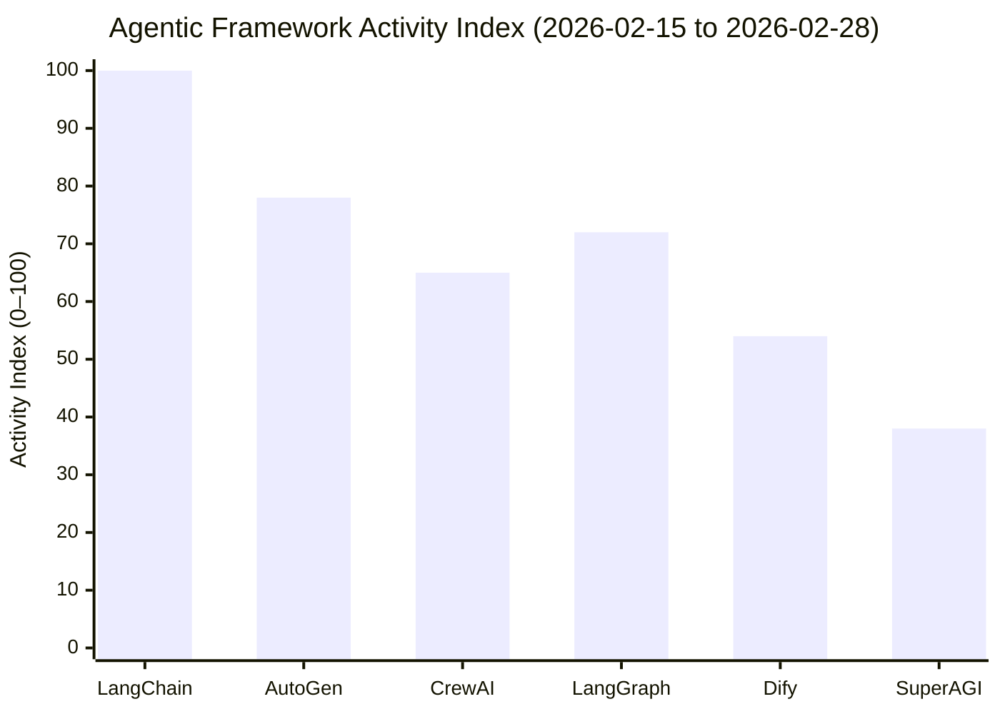

# Weekly Observations (2026-02-28)

> **Period covered:** 2026-02-15 — 2026-02-28
> **Observation timestamp:** 2026-02-28T22:00:00Z
> **Focus:** Agentic AI frameworks — trending practices, framework differentiation, and activity signals

---

## Framework Activity — Last Two Weeks

The chart below shows the relative GitHub activity (stars + PRs merged + issues closed)
for the top agentic AI repositories between 2026-02-15 and 2026-02-28, normalised to an
index of 100 for the highest-activity project (LangChain).

> **How to read this chart:** Activity Index is a composite score derived from new GitHub
> stars, merged pull requests, and closed issues for each project over the observation window.
> LangChain anchors the scale at 100; all other scores are relative.

---

## Learnings from Top Repositories

### 1. Build Small, Modular Agents

> *Observed: 2026-02-20 — LangGraph and CrewAI releases*

- Avoid creating large, monolithic AI agents.
- Focus on small, specialized agents with specific responsibilities; use an orchestrator
  agent to delegate and coordinate tasks.
- **LangGraph** (v0.2) formalises this pattern with its graph-based state machine: each
  node is a single-purpose agent or tool call, and edges define conditional routing between
  them. This makes it straightforward to add, replace, or test individual nodes without
  re-architecting the whole workflow.
- **CrewAI** models the same idea as a "crew" of role-defined agents. A typical crew might
  have a `Researcher` agent retrieving information, a `Analyst` agent evaluating it, and a
  `Writer` agent producing the final output — each isolated and independently testable.

### 2. Emphasize Prompt Engineering

> *Observed: 2026-02-22 — AutoGen and CrewAI discussion threads*

- Design stepwise, clear prompts to promote reasoning and action.
- **Chain-of-Thought (CoT)** excels when intermediate reasoning must be auditable — for
  example, a financial-analysis agent that needs to explain *why* a transaction is flagged as
  anomalous. Appending `"Think step by step."` to the system prompt reliably expands the
  model's reasoning trace and makes errors easier to catch.
- **Structured JSON outputs** shine in tool-calling pipelines. When an agent must invoke a
  REST API, returning a validated JSON schema (e.g., `{"endpoint": "...", "params": {...}}`)
  eliminates parsing ambiguity and makes downstream validation trivial. Pair this with
  OpenAI's `response_format={"type": "json_object"}` or an equivalent in your chosen SDK.
- **ReAct (Reasoning + Acting)** is the right default for multi-step tool-use loops: the
  model reasons about what to do, acts (calls a tool), observes the result, then reasons
  again — surfacing the full trace for debugging.

### 3. Leverage Open-Source Frameworks

> *Observed: 2026-02-24 — community benchmark thread on Hacker News*

- Choose the framework that matches your use case; avoid one-size-fits-all adoption.

| Framework | Best for | Avoid when |
| --- | --- | --- |
| **Dify** | Low-code / no-code teams who need a visual workflow builder and a hosted UI | You need deep programmatic control or custom execution environments |
| **AutoGen** | Multi-agent conversations where agents negotiate or critique each other (e.g., a coder agent + a reviewer agent) | Simple, single-agent pipelines where the overhead is unnecessary |
| **LangGraph** | Stateful, cyclical agent workflows with conditional branching | Linear pipelines — plain LangChain chains are simpler there |
| **CrewAI** | Rapid role-based agent team prototyping with minimal boilerplate | Production deployments requiring fine-grained execution control |
| **SuperAGI** | Teams that want a self-hosted agent runtime with a built-in GUI and toolset marketplace | Embedded use cases needing a lightweight footprint |

### 4. Focus on Iterative Testing

> *Observed: 2026-02-18 — LangChain and AutoGen CI activity*

- Frequently test agents independently and within workflows.
- Treat each agent node as a unit: mock upstream outputs and assert on downstream inputs.
- Use structured traces (LangSmith, Phoenix, or OpenTelemetry-compatible exporters) to
  replay failing runs without re-calling the LLM.

### 5. Trust and Safety

- Prioritize security and trustworthiness in AI agents.
- Monitor API interactions and limit permissions; apply the principle of least-privilege to
  every tool an agent can invoke.
- Gate destructive actions (file writes, API POSTs) behind a human-in-the-loop confirmation
  step until the agent's reliability is well-established.

### 6. Adopt Multi-Agent Patterns

- Build distributed multi-agent systems for task specialization.
- Avoid shared mutable memory between agents; prefer message-passing (events or queues) to
  simplify scaling and debugging.
- AutoGen's `GroupChat` and LangGraph's supervisor pattern are both good reference
  implementations for fan-out / fan-in task delegation.

### 7. Documentation First

- Maintain robust documentation for future maintainability.
- Document prompts, logic, and integrations at the point of authorship — retrofitting
  documentation is significantly more expensive.
- Record model versions alongside prompts; a prompt tuned for GPT-4o may degrade silently
  on a different model family.

### 8. Rapid Prototyping with Real Tasks

- Start with workflows like automating document management or API queries.
- Scale complexity as confidence and understanding grow; validate each added agent or tool
  before expanding the graph.

---

This weekly update summarises emerging trends and practices in agentic AI development.
Future observations will build upon these insights as the frameworks continue to evolve.
